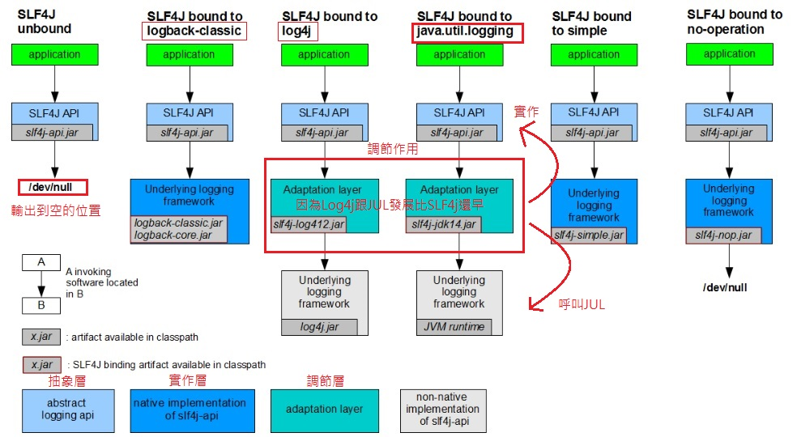
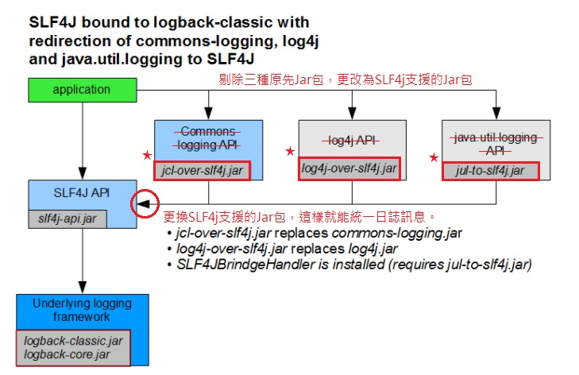
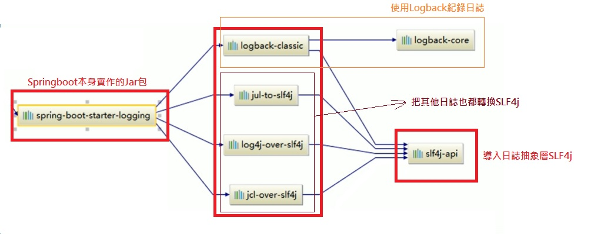
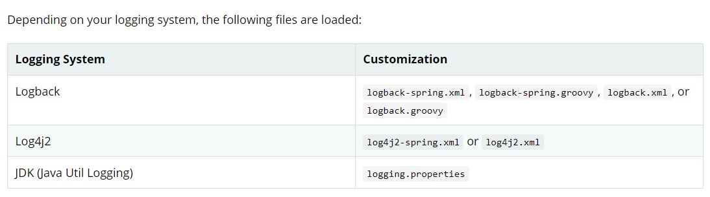
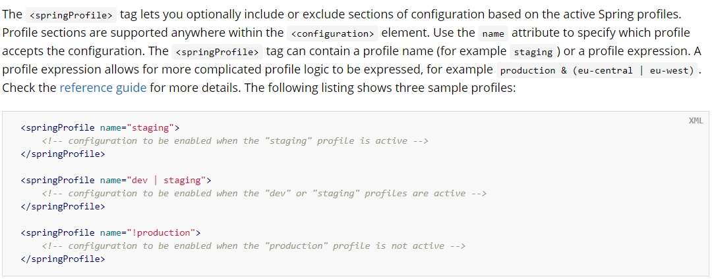

##日誌故事由來
** 一、市面上常用的日誌框架:**
>* (1)~(5)為發展順序

    1.抽象底層
        ● jboss-logging -> 不適合一般人使用，特定框架使用。(ex:Hibernate)
        (3)● JCL(Jakarta Commons Logging)  -> 自從2014年就不再更新了，Jar包名稱: commons-logging.jar。
        (4)● SLF4j(Simple Logging Facade for Java) -> 大多人使用，超強介面，利用SLF4j可轉換各種不同的日誌。
    2.日誌實作
        (1)● Log4j -> 最原始發展的日誌框架。
        (2)● JUL(java.util.logging) -> Java底層的框架(內建)，Java 1.4，本是要替代Log4j，
             但效能不佳...加上設定檔只能是*.properties，於是誕生JCL規範。
        (4)● Logback -> 繼發現JUL效能不佳，大家還是繼續使用Log4j，於是發展Logback，並同時開發SLF4j強大介面。
        (5)● Log4j2 -> java 1.6以上，由於功能太新，很多平台沒有支援，目前就是Logback與Log4j2在使用。

**二、Spring 跟 SpringBoot 框架各別使用:**

    1.Spring 底層框架 : 默認為JCL(Jakarta Commons Logging)或 ACL(Apache Commons Logging)，Jakarta是Apache的研發日誌部門
    2.SpringBoot框架 : 選用SLF4j和Logback

***

##SLF4j使用

**一、如何在系統中使用SLF4j**
>* 以後開發的時候，日誌紀錄方法呼叫，不應該直接呼叫日誌實作類，而是要先從抽象底層呼叫  
* 給系統裡面導入SLF4j的Jar檔 和 Logback的實作Jar檔

    import org.slf4j.Logger;
    import org.slf4j.LoggerFactory;  
        public class HelloWorld {
          public static void main(String[] args) {
            Logger logger = LoggerFactory.getLogger(HelloWorld.class);
            logger.info("Hello World");
          }
        }
    

**★★重點★★**
* 配置文件還是用實作的框架，像Logback and Log4j and JUL，不要配置SLF4j。

***

##遺留的問題
一、**舉例SSH框架，Sping(JCL)、Hibernate(jboss-logging)，如果我自己配(SLF4j、Logback)，那就會大亂了...**

**如何讓系統中所有的日誌統一到SLF4j:**
>● 透過圖表可以看到SLF4j都有符合各種日誌類型的Jar包，所以可以剃除原本Jar包更換該日誌有支援SLF4j就能統整了。
1. 將系統中其他日誌排除出去
2. 用中間包來替換原有的日誌
3. 我們導入SLF4j其他實作

***

##SpringBoot日誌關係
**一、spring-boot-starter-logging包內容:**

>####**總結**
**1. SpringBoot底層是使用SLF4j+Logback的方式進行日誌紀錄。**  
**2. SpringBoot也把其他日誌都替換成SLF4j。**  
**3. 替換的主要結構在哪呢? 拿(log4j-to-slf4j)Jar包來當範例:**  

    public class SLF4JLoggerContextFactory implements LoggerContextFactory {
        private static final StatusLogger LOGGER = StatusLogger.getLogger();
        
        ***主要是這邊的LoggerContext是使用new SLF4JLoggerContext()來做替換***
        private static LoggerContext context = new SLF4JLoggerContext();
        
        public SLF4JLoggerContextFactory() {
        }
***
##如何知道是否有排除掉其他框架的日誌原jar包
**一、<exclusion>裡面就包了commons-logging，將commons-logging排除**

      <dependency>
        <groupId>org.apache.activemq</groupId>
        <artifactId>activemq-leveldb-store</artifactId>
        <version>${activemq.version}</version>
        <exclusions>
          <exclusion>
            <groupId>commons-logging</groupId>
            <artifactId>commons-logging</artifactId>
          </exclusion>
        </exclusions>
      </dependency>
      
***
      
##日誌使用
**一、默認配置:**
>SpringBoot默認已經幫我們配好日誌。

    @Test
    public void testLogging() {
        d
        Logger Log = LoggerFactory.getLogger(getClass());
        
        Log.trace("這是trace日誌...");
        Log.debug("這是debug日誌...");
        Log.info("這是info日誌...");  **SpringBoot默認給我們使用的是info級別的**
        Log.warn("這是warn日誌...");
        Log.error("這是error日誌...");
    }
* 日誌級別 trace < debug < info < warn < error
* SpringBoot 默認為 info 所以 info 以上都級別都會出現 [info]、[warn]、[error]

***

**二、配置日誌設定(application.properties)**

        #日誌配置
        logging.level.com.example.jay=trace
        #logging.file={被logging.file.path整合}
        #logging.path={被logging.file.path整合}
        logging.file.path=springLogging
        logging.pattern.console=%d{yyyy-MM-dd HH:mm:ss} [%thread] %-5level %logger{50} - %msg%n
        logging.pattern.file=%d{yyyy-MM-dd HH:mm:ss} ==[%thread]== %-5level %logger{50} - %msg%n

* logging.level.com.example.jay = 指定日誌級別，可調整針對哪個Package做設定。  
* logging.pattern.console = 調整在控制台輸出的日誌  
* logging.pattern.file = 調整在輸出檔案的日誌格式  
* logging.file.path = 整合 [ logging.file ] and [ logging.path ] 可指定路徑，若不指定就單寫資料夾名稱(當下路徑產生)。

>**pattern 屬於設置日誌格式**  
* %d = 表示日期時間
* %thread = 表示執行緒的名稱，ex:[main]
* %-5level = 級別從左顯示5個字的寬度
* logger{50} = 表示logger名稱最常為50個字元，否則按照據點分割。
* %msg = 日誌的內容
* %n = 換行符號

***

**三、Springboot 配置專屬 Log 配置文件檔**
>* logback.xml = Springboot 官方文件指說，若有看到相關 xml 名稱就是直接認定為 Logging 配置文件。
* logback-spring.xml = 其他文件 Springboot 並不會直接認定為 Logging 配置文件，並可以在此配置使用 Profile 高級功能。(推薦)  

>**Springboot默認配置文件 官方說明**

>**Profile範例官方文件 (可以指定想讀的配置文件)**

**錯誤訊息 no applicable action for [springProfile]**

    #若有指定spring.profiles.active = dev或其他配置名稱
    #但卻使用logback.xml會出現下列錯誤
    #正確使用是要改為logback-spring.xml，並且去指定你所設置的Profile
    
**四、切換日誌框架簡單步驟說明**
>1. 根據SFL4j流程圖，切換哪不同的日誌框架，各有不同做法，該<exclusion>排除的就排除。
2. 部分日誌框架需要搭配適配層Jar包也要引入。
3. 注意各種框架本身搭配的日誌框架

***

##日誌框架官方連結
**一、SFL4j 切換各種框架的流程圖**  
* [SFL4j切換框架流程圖](http://www.slf4j.org/legacy.html)

**二、Springboot Logging 官方文檔**  
* [Logging 官方文檔(第四大點)](https://docs.spring.io/spring-boot/docs/2.4.0-SNAPSHOT/reference/html/spring-boot-features.html#boot-features-logging-format)